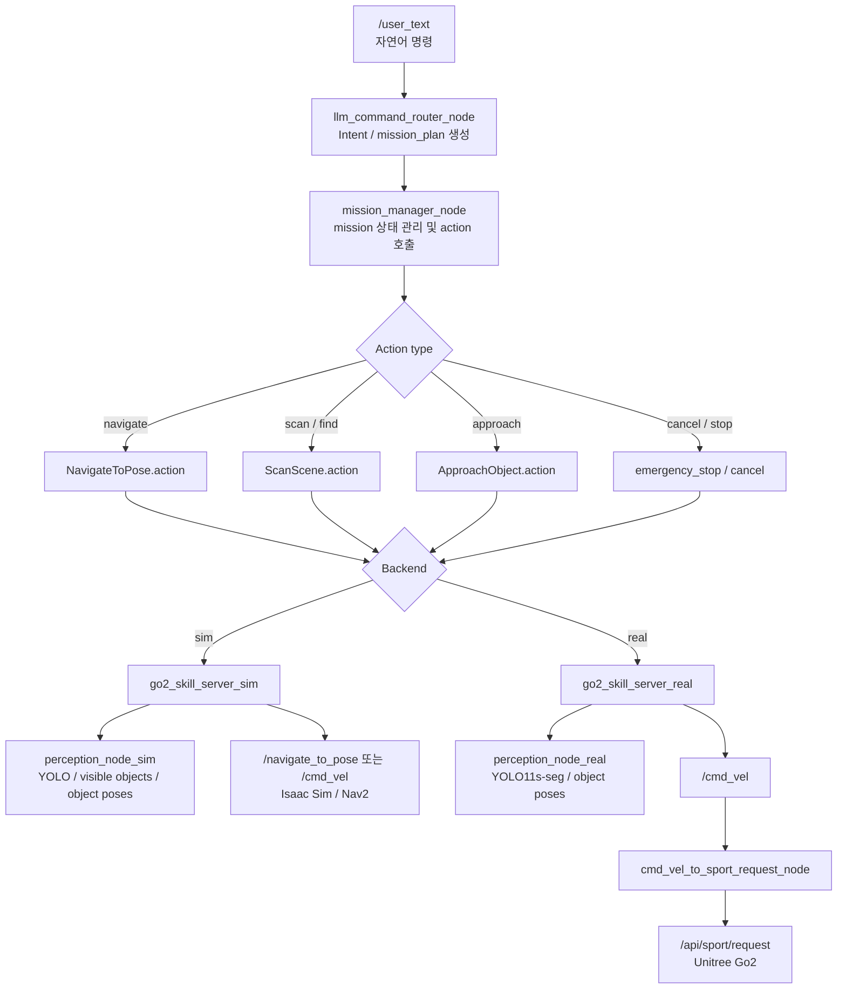

# llm_yolo

Unitree Go2 Edu를 대상으로 한 ROS 2 Humble 기반 연구 프로젝트입니다.

자연어 명령을 구조화된 mission으로 변환하고, YOLO 기반 perception과 sim/real backend를 통해 로봇 행동으로 연결합니다. 현재 구조는 **sim-first**로 개발되었고, 상위 mission 계층은 공통으로 유지한 채 `backends/sim`과 `backends/real`을 분리합니다.

```text
user text
  -> llm_command_router
  -> mission_manager
  -> llm_yolo_interfaces actions
  -> sim backend 또는 real backend
```

## Common Architecture

```text
llm_yolo/
├── llm_command_router      # 자연어 -> Intent 또는 mission_plan
├── mission_manager         # mission 실행, 조건 분기, timeout, cancel
├── llm_yolo_interfaces     # Intent.msg 및 Navigate/Rotate/Scan/Approach actions
├── backends/
│   ├── sim                 # Isaac Sim / Nav2 / sim perception
│   └── real                # Go2 camera/depth / direct approach / sport request bridge
├── launch/
│   ├── common              # 공통 mission stack
│   ├── sim                 # sim launch
│   └── real                # real launch
├── configs/
│   ├── common              # mission, LLM, named places
│   ├── sim                 # sim topics, nav, perception
│   └── real                # real topics, perception, approach, bridge, watchdog
├── scripts                 # 실행/모니터링 helper
└── docs                    # 운영 문서, 계획, 참조 문서
```

공통 노드:

| 구성 | 역할 |
|---|---|
| `llm_command_router` | `/user_text` 자연어를 `Intent` 또는 `mission_plan`으로 변환 |
| `mission_manager` | mission 실행, 조건 분기, timeout, cancel 처리 |
| `llm_yolo_interfaces` | 공통 message/action contract |

자연어 명령이 로봇 제어로 전달되는 흐름:



자세한 흐름도는 [docs/overview/architecture.md](docs/overview/architecture.md)를 참고합니다.

## Common Setup

| 항목 | 기준 |
|---|---|
| OS | Ubuntu 22.04 |
| ROS 2 | Humble |
| Python | 3.10 |
| YOLO | Ultralytics 8.4.14 |
| LLM | Ollama + `qwen2.5:latest` |

Isaac Sim용 conda 환경과 `llm_yolo`용 `.venv_yolo`는 분리해서 사용합니다.

```bash
cd /home/jnu/llm_yolo
python3 -m venv .venv_yolo
source .venv_yolo/bin/activate

python -m pip install --upgrade pip setuptools wheel
pip install pyyaml jinja2 typeguard
pip install torch torchvision torchaudio
pip install ultralytics==8.4.14
```

빌드:

```bash
cd /home/jnu/llm_yolo
source .venv_yolo/bin/activate
source /opt/ros/humble/setup.bash
colcon build
source install/setup.bash
```

모델 가중치는 GitHub에 포함하지 않습니다. 실행 전 프로젝트 루트에 배치합니다.

| 파일 | 사용 파트 |
|---|---|
| `yolo11n.pt` | Sim |
| `yolo11s-seg.pt` | Real |

`.gitignore`에서 `*.pt`는 제외되어 있습니다.

---

# Sim

## Sim Status

Sim 파트는 MVP 기능 구현과 대표 회귀 시나리오 검증이 완료된 상태입니다.

완료된 기능:

- 자연어 기반 이동, 탐색, 접근 mission 실행
- YOLO + depth 기반 객체 인식 및 object pose 추정
- Nav2 기반 이동과 direct `/cmd_vel` fallback
- `mission_plan` 기반 복합 명령과 조건 실행
- emergency stop / clear 및 person 기반 pause/resume
- 대표 sim 회귀 시나리오 검증

현재 sim 운영 기준:

| 항목 | 상태 |
|---|---|
| Sim environment | Isaac Sim 5.1.0 + 외부 Go2 sim |
| YOLO model | `yolo11n.pt` |
| Perception mode | `yolo` |
| Depth mode | `bbox_cluster` |
| Named places | `center`, `chair_room`, `commode_room`, `tv_room`, `living_room` |
| Operational object classes | `chair`, `tv` |
| Navigation | Nav2 우선, direct fallback 유지 |
| Person safety | pause/resume 및 거리 조건 검증 완료 |

## Sim Run Commands

### 1. Isaac Sim / Go2 Sim

외부 Go2 Isaac Sim 환경이 먼저 실행되어 있어야 합니다.

```bash
source /opt/ros/humble/setup.bash
conda activate isaaclab
python /home/jnu/go2_sim/scripts/go2_sim.py
```

Nav2를 사용하는 경우 별도 터미널에서 Go2 sim navigation stack을 실행합니다.

### 2. llm_yolo Sim Stack

```bash
bash /home/jnu/llm_yolo/scripts/run_sim.sh
```

수동 실행:

```bash
cd /home/jnu/llm_yolo
source .venv_yolo/bin/activate
source /opt/ros/humble/setup.bash
source install/setup.bash
ros2 launch launch/sim/mvp_sim.launch.py
```

### 3. Sim Web Monitor

```bash
bash /home/jnu/llm_yolo/scripts/run_monitor_dashboard.sh 127.0.0.1 8765 --no-open --mode sim
```

`--mode auto`를 사용하면 `eno1`이 살아 있을 때 real, 아니면 sim으로 동작합니다.

```bash
bash /home/jnu/llm_yolo/scripts/run_monitor_dashboard.sh 127.0.0.1 8765 --no-open --mode auto
```

## Sim Command Examples

```bash
ros2 topic pub --once /user_text std_msgs/msg/String "{data: 'chair 앞으로 가'}"
```

대표 검증 명령:

```text
접근 미션: chair 앞으로 가
미션 플랜: chair 찾고 없으면 center로 복귀
정지: 긴급 정지
정지 해제: 정지 해제
```

## Sim Monitoring

```bash
ros2 topic echo /mission_state
ros2 topic echo /mission_plan
ros2 topic echo /perception/visible_objects
ros2 topic echo /perception/object_poses
ros2 topic echo /perception_debug
ros2 topic echo /emergency_stop
```

Helper script:

```bash
/home/jnu/llm_yolo/scripts/monitor_sim.sh core
/home/jnu/llm_yolo/scripts/monitor_sim.sh perception
/home/jnu/llm_yolo/scripts/monitor_sim.sh object
/home/jnu/llm_yolo/scripts/monitor_sim.sh safety
/home/jnu/llm_yolo/scripts/monitor_sim.sh plan
/home/jnu/llm_yolo/scripts/monitor_sim.sh nav
```

ROS bag 기록:

```bash
bash /home/jnu/llm_yolo/scripts/record_bag.sh
```

## Sim Config Files

| 파일 | 설명 |
|---|---|
| [configs/sim/sim_topics.yaml](configs/sim/sim_topics.yaml) | sim action/topic wiring |
| [configs/sim/sim_perception_params.yaml](configs/sim/sim_perception_params.yaml) | sim YOLO/depth parameters |
| [configs/sim/sim_named_places.yaml](configs/sim/sim_named_places.yaml) | sim named place coordinates |
| [configs/sim/sim_visible_objects.json](configs/sim/sim_visible_objects.json) | sim visible object mapping |
| [configs/common/llm_params.yaml](configs/common/llm_params.yaml) | LLM backend, named places, object classes |
| [configs/common/mission_params.yaml](configs/common/mission_params.yaml) | mission timeout, fallback, approach distance |

---

# Real

## Real Status

Real 파트는 1차 실기체 backend 구현과 일부 end-to-end 경로 1차 확인이 완료된 상태입니다. 현재 real 범위는 global navigation이 아니라 **현재 시야 내 객체를 `camera_link` 기준 상대 pose로 접근하는 direct approach**입니다.

완료 및 확인된 내용:

- 실기체용 perception, approach, watchdog, bridge 노드 통합
- YOLO11s-seg + depth mask cluster 기반 object pose 추정
- `camera_link` 기준 local approach 구조 구현
- `/cmd_vel -> /api/sport/request` bridge 구현
- `chair 앞으로 가` 경로의 1차 성공 흐름 확인
- emergency stop 관련 stop/abort 경로 반영

현재 real 운영 기준:

| 항목 | 상태 |
|---|---|
| Real robot | Unitree Go2 Edu + `unitree_ros2` |
| YOLO model | `/home/jnu/llm_yolo/yolo11s-seg.pt` |
| Depth mode | `mask_cluster` |
| Object pose frame | `camera_link` |
| Camera image | `/camera/color/image_raw` |
| Depth image | `/camera/depth/image_rect_raw` |
| Camera info | `/camera/color/camera_info` |
| Command output | `/cmd_vel` |
| Final robot command | `/api/sport/request` |
| Bridge | `cmd_vel_to_sport_request_node` |
| Visual markers | `/perception/object_markers` |

Real perception candidate classes:

```text
person, chair, couch, dining table, tv, laptop, keyboard, mouse, bottle, cup
```

Natural-language command target classes currently configured:

```text
chair, couch, dining table, tv
```

## Real Run Commands

Real 실행은 Go2 실기체, `unitree_ros2`, 카메라/depth topic, `/api/sport/request`가 준비된 상태를 전제로 합니다.

```bash
bash /home/jnu/llm_yolo/scripts/run_real.sh
```

수동 실행:

```bash
cd /home/jnu/llm_yolo
source /home/jnu/llm_yolo/.venv_yolo/bin/activate
source /home/jnu/unitree_ros2/setup.sh
source /home/jnu/llm_yolo/install/setup.bash
export PYTHONPATH="/home/jnu/llm_yolo/.venv_yolo/lib/python3.10/site-packages:${PYTHONPATH:-}"
ros2 launch /home/jnu/llm_yolo/launch/real/mvp_real.launch.py
```

onboard guard만 실행:

```bash
bash /home/jnu/llm_yolo/scripts/run_onboard_min.sh
```

Real web monitor:

```bash
bash /home/jnu/llm_yolo/scripts/run_monitor_dashboard.sh 127.0.0.1 8765 --no-open --mode real
```

## Real Command Examples

현재 real 1차 확인 중심 명령은 아래입니다.

```bash
# 객체 탐색 경로
ros2 topic pub --once /user_text std_msgs/msg/String "{data: 'chair 찾아'}"

# 객체 접근 경로
ros2 topic pub --once /user_text std_msgs/msg/String "{data: 'chair 앞으로 가'}"

# 안전 제어
ros2 topic pub --once /user_text std_msgs/msg/String "{data: '긴급 정지'}"
ros2 topic pub --once /user_text std_msgs/msg/String "{data: '정지 해제'}"
```

## Real Monitoring

```bash
ros2 topic echo /mission_state
ros2 topic echo /perception/visible_objects
ros2 topic echo /perception/object_poses
ros2 topic echo /perception_debug
ros2 topic echo /perception/object_markers
ros2 topic echo /cmd_vel
ros2 topic echo /api/sport/request
ros2 topic echo /emergency_stop
```

RViz 설정:

```text
rviz/real_perception.rviz
```

## Real Config Files

| 파일 | 설명 |
|---|---|
| [configs/real/real_topics.yaml](configs/real/real_topics.yaml) | real sensor/control topic mapping |
| [configs/real/real_perception_params.yaml](configs/real/real_perception_params.yaml) | real YOLO segmentation/depth parameters |
| [configs/real/real_nav_params.yaml](configs/real/real_nav_params.yaml) | real approach control parameters |
| [configs/real/cmd_vel_bridge_params.yaml](configs/real/cmd_vel_bridge_params.yaml) | `/cmd_vel` to `/api/sport/request` bridge |
| [configs/real/watchdog_params.yaml](configs/real/watchdog_params.yaml) | real watchdog/deadman guard |

---

## Documentation

| 문서 | 설명 |
|---|---|
| [docs/README.md](docs/README.md) | 문서 목차 |
| [docs/overview/architecture.md](docs/overview/architecture.md) | 전체 구조 |
| [docs/operation/sim_mode.md](docs/operation/sim_mode.md) | sim 운영 |
| [docs/operation/real_mode.md](docs/operation/real_mode.md) | real 운영 |
| [docs/operation/test_scenarios.md](docs/operation/test_scenarios.md) | sim 회귀 시나리오 |
| [docs/reference/mission_plan_schema.md](docs/reference/mission_plan_schema.md) | mission plan schema |
| [docs/reference/sim_ros2_contract.md](docs/reference/sim_ros2_contract.md) | Isaac Sim ROS 2 contract |
| [docs/planning/sim_progress.md](docs/planning/sim_progress.md) | sim 완료 기록 |
| [docs/planning/real_progress.md](docs/planning/real_progress.md) | real 진행 기록 |

## Repository Notes

GitHub에는 다음 산출물을 포함하지 않습니다.

```text
.venv_yolo/
build/
install/
log/
bags/
*.pt
mobileclip_blt.ts
```

현재 모델 파일은 로컬에 직접 배치해서 사용합니다. `mobileclip_blt.ts`는 현재 코드 경로에서 사용하지 않는 open-vocabulary 실험용 모델 아티팩트로 분류했습니다.
